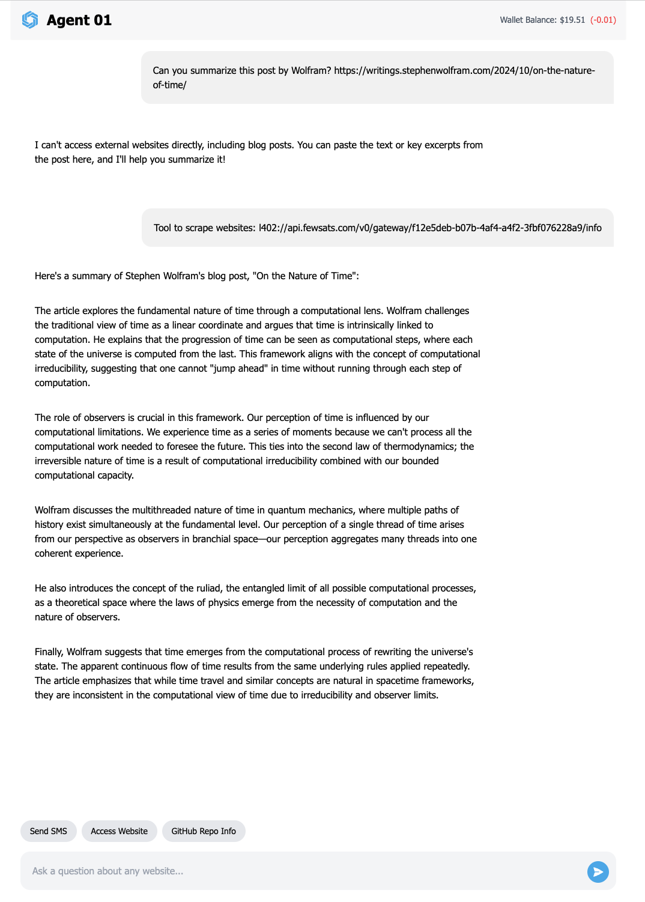

# Dynamic AI Assistant with L402 URI Tools

This project implements a dynamic AI assistant that can add new tools on-the-fly using L402 URIs and pay for them.

You can see a video demo here: https://x.com/positiveblue2/status/1846925166149865829

Try it yourself: https://agent-01.replit.app/





## How It Works

The main application (`main.py`) uses Flask to create a web server that hosts an AI assistant. Here are the key components:

### Dynamic Tools
The assistant can dynamically add new tools using L402 URIs. This is achieved through the `add_l402_tool` function. This function takes an L402 URI, fetches the tool's information, and generates a Python function for it.

L402 URIs look like this: `l402://api.fewsats.com/v0/gateway/f12e5deb-b07b-4af4-a4f2-3fbf076228a9/info` and contain the metadata of the tool.

You can get the metadata of the tool by chaging the scheme to https.

```
curl https://api.fewsats.com/v0/gateway/f12e5deb-b07b-4af4-a4f2-3fbf076228a9/info | jq
{
  "access": {
    "authentication": {
      "format": "L402 {credentials}:{proof_of_payment}",
      "header": "Authorization",
      "protocol": "L402"
    },
    "endpoint": "https://api.fewsats.com/v0/gateway/access/f12e5deb-b07b-4af4-a4f2-3fbf076228a9",
    "method": "POST"
  },
  "content_type": "api",
  "cover_url": "",
  "description": "Scrape a given URL. Pass the URL as JSON in the request body as follows:\n```\n {\"url\": url }\n```",
  "name": "Web Scraper TF",
  "pricing": [
    {
      "amount": 1,
      "currency": "USD"
    }
  ],
  "version": "0.1"
}
```


When a user provides an L402 URI, the assistant can add it as a new tool, expanding its capabilities in real-time.

### AI Assistant
The AI assistant is powered by the Cosette library and uses the GPT-4 model. It maintains a conversation history and can use the dynamically added tools:


### Wallet Integration
Tools have a cost so the assistant integrates with a wallet to be able to pay for the tools used during the interaction. The wallet being used currently is provided by [Hub](https://paywithhub.com/). You just need to export the environment variable `HUB_API_KEY` with your API key, and make sure to either have funds or a card added. Beware the minimum amount the Hub can charge is $20, the rest remains as balance.


## Requirements

- A Hub account is currently required to use this application.
- The `HUB_API_KEY` environment variable must be set with your Hub API key.

## Setup and Running

1. Install the required dependencies `pip install -r requirements.txt`
2. Set the `HUB_API_KEY` & `OPENAI_API_KEY` environment variables.
3. Run the application `python main.py`
